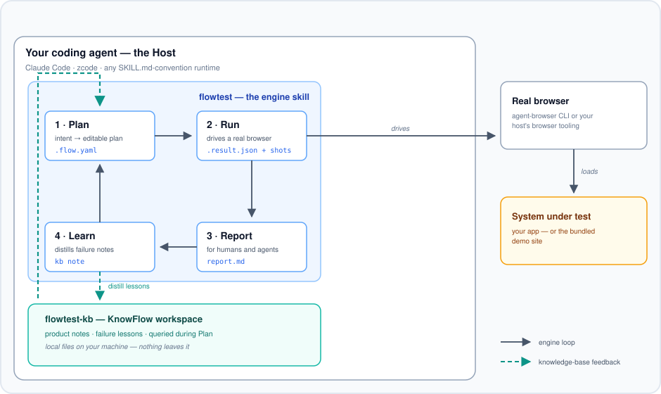

# flowtest

> Natural-language browser testing for coding agents: describe the user journey, your agent turns it into a `.flow.yaml` plan, runs it in a real browser, reports, and learns from failures.

[](LICENSE)
[](https://github.com/jerryjiao/flowtest/releases)

**Docs & demo: [jerryjiao.github.io/flowtest](https://jerryjiao.github.io/flowtest/)** ·
[中文说明](README.zh-CN.md)

<p align="center">
  
</p>
<p align="center"><em>The engine loop lives inside your coding agent; the knowledge base feeds lessons back into every Plan.</em></p>

## Why flowtest

You can already ask a coding agent to "test the signup flow" with Playwright. flowtest differs in three ways:

- **Plans are artifacts, not chat history.** The journey becomes a `.flow.yaml` file you can read, edit, review, and version. The agent proposes the plan; nothing executes until you've seen it.
- **No new runtime.** flowtest ships as two agent skills for hosts you already run — Claude Code, zcode, or any SKILL.md-convention agent. The same agent that writes your app tests it. No daemon, no lock-in.
- **Failures compound into memory.** Every failed run is distilled into a local knowledge base that the next Plan consults, so the loop gets sharper with use — entirely on your machine.

## Quickstart (measured: first passing flow in ~2 minutes)

You need a SKILL.md-convention host (Claude Code, zcode, …), Python 3 with
PyYAML, and any static file server:

```bash
git clone https://github.com/jerryjiao/flowtest && cd flowtest
python3 -m http.server 4173 -d demo        # serve the demo site
```

Then ask your agent: **“Run the flow at
`skills/flowtest/examples/demo-smoke.flow.yaml`.“** The engine skill takes
over: validate → resolve vars → drive a real browser → write the result JSON
and report under `flowtest/reports/`.

Re-running in the same browser? Click **Reset demo data** and **Sign out** on
the demo site first — with a live session the flow's sign-in precheck skips
and the run comes back PARTIAL instead of PASS.

Want to test your own app instead? Describe the journey — “test that a user
can sign up with an email and verify the confirmation screen” — and the
agent writes the flow for your confirmation before anything executes.

## How it works

The engine skill runs a four-stage loop inside your host. Each stage writes
a file you can inspect:

| Stage | What happens | Artifact |
|---|---|---|
| **Plan** | A plain-language intent becomes a structured, reviewable test plan | `*.flow.yaml` |
| **Run** | Your agent drives a real browser, step by step, with screenshots | `*.result.json` |
| **Report** | The result is rendered for humans and agents alike | `*.report.md` |
| **Learn** | Failed runs are distilled into lessons; the next Plan queries them | KB notes |

The fourth stage is the differentiator: lessons land in `flowtest-kb`, a
local [KnowFlow](https://github.com/jerryjiao/knowflow) workspace, and flow
back into every subsequent Plan (the teal arrows in the diagram above).

Deep dives on the docs site: [the engine loop](https://jerryjiao.github.io/flowtest/en/engine/) ·
[the flow format](https://jerryjiao.github.io/flowtest/en/flow-format/) ·
[the knowledge base](https://jerryjiao.github.io/flowtest/en/kb/) ·
[the demo site](https://jerryjiao.github.io/flowtest/en/demo-site/)

## The flow format

A flow is plain YAML — steps, semantic targets, expectations. From the
shipped example ([full file](skills/flowtest/examples/demo-smoke.flow.yaml)):

```yaml
flow: demo-smoke
title: "Visitor can sign in, create a task, and complete it on the demo site"
sut: demo-site
baseUrl: http://localhost:4173
vars:
  DEMO_USER: demo@flowtest.dev
  DEMO_PASSWORD: demo-password

steps:
  - id: fill-email
    action: fill
    target: "textbox 'Email'"
    value: "{{DEMO_USER}}"

  - id: submit-signin
    action: click
    target: "button 'Sign in'"
    expect:
      - element: "heading 'Tasks'"
      - not_text: "Invalid credentials"

  - id: grab-summary
    action: extract
    value: [open-count, done-count]
```

Targets read like role names, not CSS selectors — the host resolves them
against the live page, which is what keeps flows readable and healable.
The [format reference](https://jerryjiao.github.io/flowtest/en/flow-format/)
covers every action, expectation, and phase.

## Reading a report

Every run writes a machine result (`*.result.json`) and derives a human
report (`*.report.md`) from it. A real excerpt from the shipped demo run:

```json
{
  "flow": "demo-smoke",
  "backend": "agent-browser",
  "verdict": "PASS",
  "counts": { "passed": 9, "healed": 0, "failed": 0, "skipped": 0, "total": 9 },
  "steps": [
    {
      "id": "submit-signin",
      "action": "click",
      "target": "button 'Sign in'",
      "status": "PASSED",
      "durationMs": 9000,
      "screenshot": null
    }
  ]
}
```

Each step lands in one of four states — `PASSED`, `HEALED` (the target
moved and the run recovered), `FAILED`, or `SKIPPED` — and the flow-level
verdict is `PASS`, `PARTIAL`, or `FAIL`. Failures carry an error string and
a screenshot path, so the Learn stage distills from evidence, not vibes.

## Install

**Claude Code / zcode (plugin):** add this repo as a marketplace, then install —
the two skills (`flowtest`, `flowtest-kb`) are discovered automatically:

```bash
claude plugin marketplace add jerryjiao/flowtest
claude plugin install flowtest@flowtest
```

In zcode: Settings → Plugin Management → Discover → **+** → `jerryjiao/flowtest`
→ **Get**. (Verified install: `claude plugin install` reports *Skills (2):
flowtest, flowtest-kb*; zcode reads the same `.claude-plugin/` manifests.)

**Any SKILL.md host:** copy the [`skills/`](skills/) directory — each skill is
self-contained.

## Project layout

```
skills/flowtest/       the engine: Plan → Run → Report → Learn (+ .flow.yaml format & validator)
skills/flowtest-kb/    the memory: a local KnowFlow workspace of lessons and product notes
demo/                  the demo site: zero-dependency SUT for the example flows
flowtest/              a live workspace: example run artifacts + seeded KnowFlow KB
site/                  the website (Astro + Starlight), deployed to GitHub Pages
tests/                 flow-format validator tests + repo structure & scrub gates
```

## Contributing & license

[MIT](LICENSE). Issues and PRs welcome — start with
[CONTRIBUTING.md](CONTRIBUTING.md) for the workflow and vocabulary.
